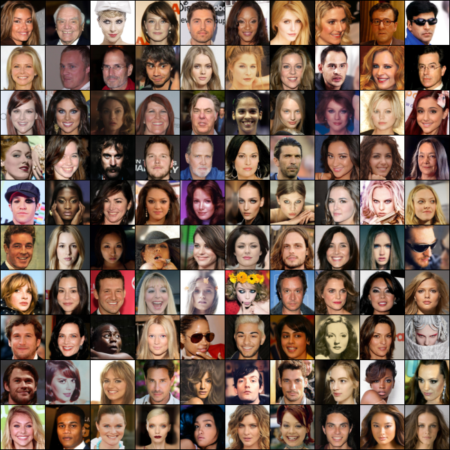
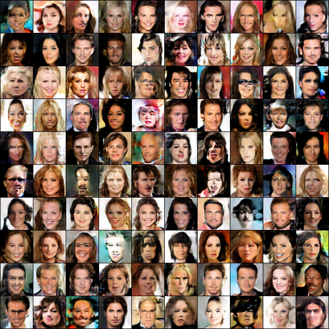

# 各种GAN的实验
> 作者： 周孩\
> 机构： 北京邮电大学\
> 联系方式：1583124882@qq.com 

用各种gan的模型来跑实验。

## 模型
* [DCGAN](https://arxiv.org/abs/1511.06434)

## 数据集
* [CelebA](https://drive.google.com/drive/folders/1YRRaC3LWLHorVhFNJPzVqLrUlA10eLEJ)

## 环境准备
```
conda create -n zh python=3.9
conda activate zh
python3 -m pip install --upgrade pip
pip3 install -r requirements.txt
```

## 运行
本次实验使用显卡 3*3090。若要修改显卡个数，可以修改 *--proc_per_node=<显卡个数>*
* DCGAN
```
torchrun --nproc_per_node=3 run.py --log_steps 10 --model dcgan --epochs 300
```

## 实验结果
* 真实样本



### DCGAN
* 训练过程


* 较好的一张




**注意：** 继续训练更多的轮次应该会有更好的结果，但是受到金钱的限制，
此次训练到300轮就结束。