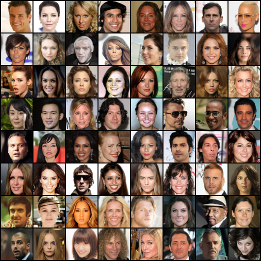
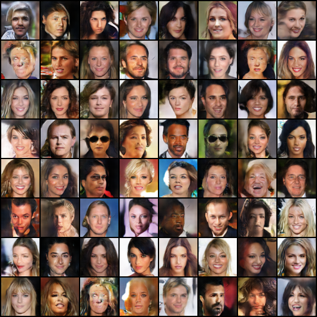
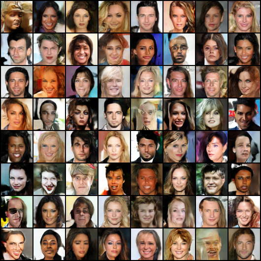

# GANs
> Author： Hai Zhou\
> Institution： Beijing University of Posts and Telecommunication\
> mail：1583124882@qq.com 

Run experiments with various GAN model

## Model
We compare the following models:
* [DCGAN](https://arxiv.org/abs/1511.06434)
* [WGAN](https://arxiv.org/abs/1701.07875)
* [SAGAN](https://arxiv.org/abs/1805.08318v2)

### [DCGAN](https://arxiv.org/abs/1511.06434)

<p align="center"></p>

Architecture guidelines for stable DCGAN
* Replace any pooling layers with strided convolutions(discriminator) and fractional-strided convolutions(generator).
* Use batchnorm in both the generator and the discriminator.
* Remove fully connected hihdden layers for deeper architectures.
* Use ReLU activation in generator for all layers except for the output, which uses Tanh.
* Use LeakyReLU activation in the discriminator for all layers.

### [WGAN](https://arxiv.org/abs/1701.07875)
Since GAN[^1] was born, it has been difficult to train. WGAN fundamentally solves this problem with four improvements.
* Remove the *Sigmoid* activation function of the discriminator.
* The loss function removes the *log* operation.
* After each update of the discriminator parameters truncate their absolute values to no more than a fixed constant c.
* Replace Adam optimizer with RMSProp.

### [SAGAN](https://arxiv.org/abs/1805.08318v2)
<p align="center"></p>
The author proposes to use Self-Attention Generative Adversarial Network (SAGAN) for image generation tasks. In order to ensure the stability of model training, the author proposes

* apply spectral normalization to the GAN generator and as well as in the discriminator. 
* confirm that the twotimescale update rule (TTUR).

## Dataset
* A dataset of 30,000 face，[CelebA](https://drive.google.com/drive/folders/1YRRaC3LWLHorVhFNJPzVqLrUlA10eLEJ)

## Configuration Environment
```
conda create -n zh python=3.9
conda activate zh
python3 -m pip install --upgrade pip
pip3 install -r requirements.txt
```

## Run
if your dataset path is *./dataset/data/*
* DCGAN
```bash
torchrun --nproc_per_node=1 run.py --log_steps 10 --model dcgan --epochs 300 --batch_size 64
```

* WGAN
```bash
torchrun --nproc_per_node=1 run.py --log_steps 10 --model wgan --epochs 300 --lr 5e-5 --batch_size 64
```

* SAGAN
```bash
torchrun --nproc_per_node=3 run.py --log_steps 10 --model sagan --epochs 1000 --batch_size 64
```

## Experimental results
You can enjoy the results in `./results`.

* real example

<p align="center"></p>

### DCGAN

<p align="center"></p>

### WGAN

<p align="center"></p>

### SAGAN


### Evaluate
| Model |  Fid  |
|:-----:|:-----:|
| DCGAN | 24.86 |
| WGAN  | 25.63 |
| SAGAN |       |

**Notice:** *Continuing to train for more epochs should give better results, but is limited by money,
The training ends after 250 rounds.*

# References
* [WGAN Bolg](https://zhuanlan.zhihu.com/p/25071913) 
* [WGAN](https://arxiv.org/abs/1701.07875)
* [pytorch](https://pytorch.org/tutorials/beginner/dcgan_faces_tutorial.html?highlight=dcgan)